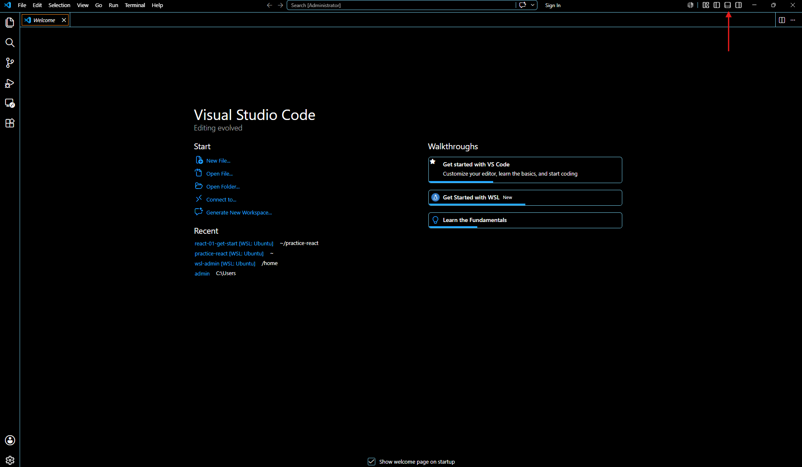

# Getting Started with React.js and Setup the Development Environment
React.js is an open-source JavaScript library designed for building modern, interactive user interfaces. It’s especially well-suited for single-page applications where content needs to update dynamically without reloading the entire page. Developed and maintained by Meta (formerly Facebook) together with a large developer community, React provides a component-based architecture that makes it easier to create reusable UI elements and manage application state efficiently

Before building applications with React.js, you’ll need to set up a proper development environment. This ensures you have the right tools to create, test, and run your projects smoothly

### Topics

[x] [Getting Started with React.js](#setting-started-with-eact.js)

[x] [Install WSL for Windows user](#install-wsl-for-windows-user)

[x] [Install node & npm](#install-node.js-and-npm)

[x] [Install Visual Studio Code](#install-visual-studio-code)

[x] [Install Prettier Code Formatter](#install-prettier-code-formatter)

[x] [Create your first app](#create-your-first-app)

[x] [Challenge Setup Git and commit your first code](#challenge-setup-git-and-commit-your-first-code)

---

## Install WSL for Windows user

> Skip this step for Mac or Linux user

### What is WSL?
WSL stands for Windows Subsystem for Linux, a feature that allows you to run a full Linux environment directly inside Windows

It eliminates the need to run heavy virtual machines or dual-boot your computer, giving you seamless access to a Linux terminal right alongside your standard Windows desktop applications

### Why Developers Use It?
Most web servers run on Linux, and modern tools (Node.js, Git, Docker) are designed with Linux-first support. WSL gives Windows developers the same environment used in production

Key Benefits
- Performance: Native file system speeds and better resource management make React and Vite builds faster
- Integration: Access Windows files from Linux, and launch VS Code to edit projects directly
- Convenience: Run Linux commands (bash, grep, ssh) alongside Windows apps without rebooting
- Initiative: Take the opportunity to learn essential Linux commands; A skill that will strengthen your development workflow and align you with industry practices

### How to Install It?
By default, Windows does not enable these features. You only need to do this once:
- Turn on Virtual Machine Platform
- Turn on Windows Subsystem for Linux (WSL)

Run as Administrator  
Open PowerShell or Windows Terminal, making sure you run it with administrator rights
```bash
# 1. Enable Virtual Machine Platform
dism.exe /online /enable-feature /featurename:VirtualMachinePlatform /all /norestart

# 2. Enable Windows Subsystem for Linux Feature
dism.exe /online /enable-feature /featurename:Microsoft-Windows-Subsystem-Linux /all /norestart

# 3. Prompt user for the required system reboot
Write-Host "Features enabled successfully! Please restart your computer to apply changes." -ForegroundColor Green

# 4. Reboot Windows
Restart-Computer

# 5. When the Windows reboot, Open PowerShell or Windows Terminal, making sure you run it with administrator rights
wsl --install

# Enter your Linux username
# Enter your Linux password

# 6. Run this command and check the WSL version
wsl -l -v

# Output should be running:
# NAME      STATE           VERSION
# * Ubuntu    Running         2

# 7. Enter to WSL environment
wsl                 

# Output - will be enter and show this directory: 
<linuxuser>@<compunter-name>:/mnt/c/Users/<windows-user-name>$
```

---

## Install Node.js and npm

### What is Node.js?
Node.js is an open-source, cross-platform runtime environment that allows you to run JavaScript code outside of a web browser
[... Read more about Node.js](https://nodejs.org/learn/getting-started/introduction-to-nodejs)

### What is npm?
It stands for Node Package Manager (npm), and it is the official package manager and code registry for Node.js.When you install Node.js, npm is automatically installed on your computer. It is the world's largest software registry, containing over two million free blocks of code that developers share with each other
[... Read more about npm](https://docs.npmjs.com/about-npm)

React requires Node.js to run. Installing Node.js also gives you access to npm (Node Package Manager), which is used to manage project dependencies

> In a real working environment, most development teams do not use the latest version until it has been tested and approved for upgrade. Therefore, we must also know how to install a specific Node.js version to align with the team’s setup

Example: The teams required to use 24.16.0

```bash
# 1. Open PowerShell or Windows Terminal
wsl                             # Enter wsl environment
cd /home/<user-directory>       # Navigate to user home directory

# 2. Verify Node and Npm version
node -v                     # Output: v24.15.0 - current installed version
npm -v                      # Output: 11.12.1  - current installed version

# Your environment did not show the version, which means Node is not yet installed
# 3. Download and install NVM (Only for one-time)
curl -o- https://raw.githubusercontent.com/nvm-sh/nvm/master/install.sh | bash

# 4. Reload Your Shell
source ~/.bashrc

# 5. List version
nvm ls-remote               # You should be find v24.16.0

# 6. Install a Specific Node.js Version
nvm install 24.16.0
```
```
Output after execute the nvm install:
Downloading and installing node v24.16.0...
Downloading https://nodejs.org/dist/v24.16.0/node-v24.16.0-linux-x64.tar.xz...
######################################################################################################################################################## 100.0%
Computing checksum with sha256sum
Checksums matched!
Now using node v24.16.0 (npm v11.13.0)
```
```bash
# 7. Use a Specific Node.js Version
nvm use 24                  #   Output: Now using node v24.16.0 (npm v11.13.0)

# 8. Verify the active version
node -v                     # v24.16.0
npm -v                      # 11.13.0

# 9. Set a Specific Version as Default
nvm alias default 24        # Output: default -> 24 (-> v24.16.0)
```

---

## Install Visual Studio Code

### What is IDE?
An IDE (Integrated Development Environment) is software that combines key developer tools—like a code editor, compiler, debugger, and version control—into one place. It makes writing, testing, and managing code faster and easier. Think of it as a single workspace for all your coding needs

### Why use Visual Studio Code?
Visual Studio Code (VS Code) - it’s free IDE, lightweight, cross‑platform, and highly customizable, with built‑in Git integration, debugging tools, and a massive extension marketplace that makes it ideal for both beginners and experienced developers. It’s currently the most popular editor worldwide, especially for web development and frameworks

### Install Visual Studio Code (Only one-time)
1. Go to official - [Visual Studio Code](https://code.visualstudio.com/)
2. Download and install
3. For Windows user launch the VS Code Editor, default is on Windows environment
4. To use WSL environment, launch the PowerShell terminal in the code editor
5. Click the panel button as shown in the below image, or press Ctrl + 'j'



```bash
# At this command line PS C:\Users\admin>, execute command:
wsl

# Tip: Most of the beginner may not able to find the user-directory or forgotten, then run this command
ls /home                    # the list directory command will list the user directory

# Navigate to user home directory
cd /home/<user-directory>

```
---

## Install Prettier Code Formatter
Prettier is an automated tool that instantly cleans up your code style. It removes the hassle of manual formatting by taking complete control of your layout
1. Open the vs code, press Ctrl + Shift + 'x'
2. Search for 'Prettier - Code formatter', and install it
3. After installed, press Ctrl + ',' search for 'Editor: Format on save' and check the setting
4. Next, search for 'Prettier: Require Config and check the setting
5. Next, search for 'Prettierr: Use Editor Config' and check the setting

---

## Create your first app
Let’s create a basic app with Vite + JavaScript to test the environment, and at the same time take the opportunity to learn some basic Linux commands

```bash
# For example:
# User directory: home/admin
# Project root directory: practice-react
# App directory: basic-app
# Use cd command to change directory
# Use mkdir command to make new directory

# Change or navigate to user directory
cd /home/admin

# Create new directory
mkdir practice-react

# Create app with Vite + JavaScript
npx create-vite@latest basic-app --template react

# Install with npm and start now? Select 'Yes'

# Then press Ctrl + click on the ➜  Local:   http://localhost:5173/
# To open the browser and run your first app
```

## Challenge Setup Git and commit your first code

### Check and update Git in wsl
```bash
# 1. Check the current Git version
git --version       # Output: git version 2.x.x

# 2. Highly recommended to use latets version
sudo apt update             # update the envinronment
sudo apt install git -y     # update latest Git version
```

### Create new repository at GitHub
1. Go to https://github.com/
2. Create a new account (if not sign-up an account)
3. Click New to create new repository
4. Give it a name (e.g., basic-app)
5. Do NOT initialize with README (important if you already have local files)
6. Click Create repository

### Generate an SSH key for connecting to GitHub

[Click this link to learn how to generate SSH key](https://github.com/laoniu-meow/git-02-generate-key-configuration)

```bash
# 1. Ensure navigate to the project directory, example:
cd ~/practice-react/basic-app

# 2. Initialize Git
git init

# 3. Create git usename and email
git config --global user.name "your-username"
git config --global user.email "your-email"

# 4. Configure Line Ending  
# Configuring end-of-line settings is important but often overlooked,
# as it helps prevent inconsistencies and issues when working across different operating systems
# For Windows user
git config --global core.autocrlf true

# or Mac or Linux user
git config --global core.autocrlf input

# 5. Verify default identity
git config --global --list

# 6. Registers a remote repository URL
git remote add origin git@github.com:<change git username here>/basic-app.git

# 7. Check the connected to remote repository
git remote -v

# 8. Check status
git status

# 9. Stage your changes and check the status
git add .
git status

# 10. Commit changes
git commit -m 'Add your commit message'

# 11. Add git branch - main
git branch -M main

# 12. Check branch
git branch

# 13. Push code to remote repository with --set-upstream for the first commit
git push --set-upstream origin main
```